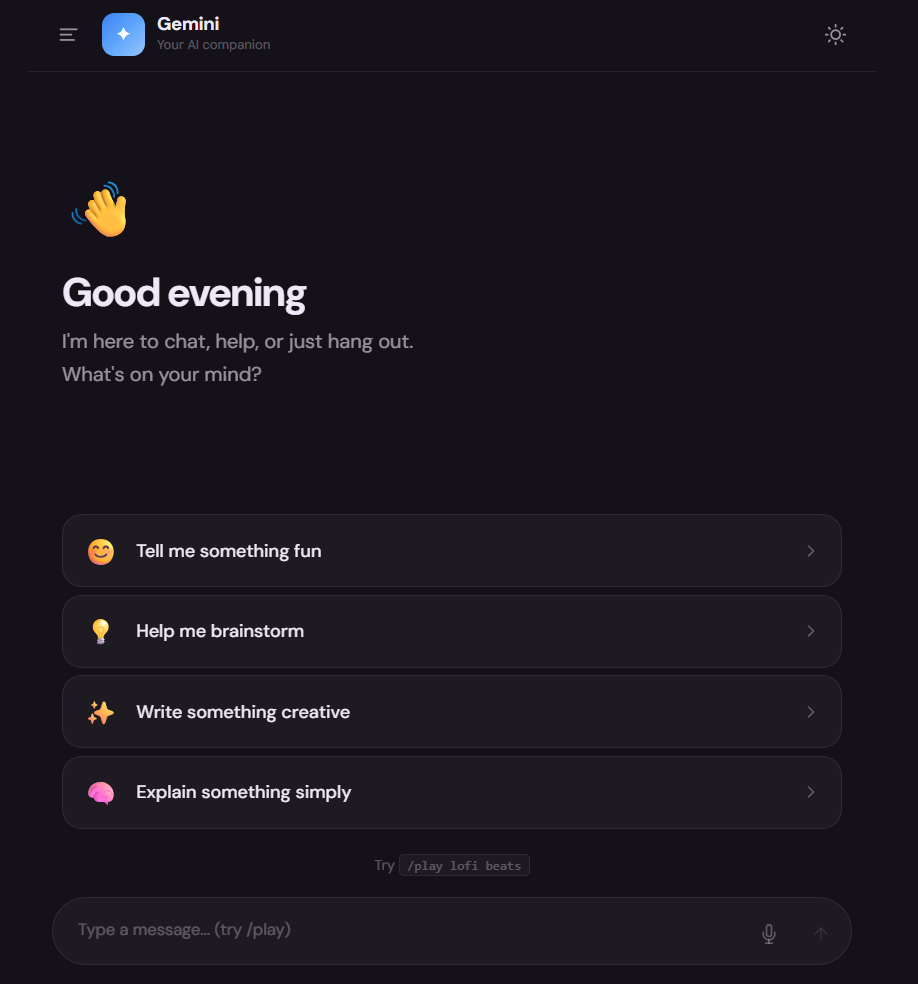
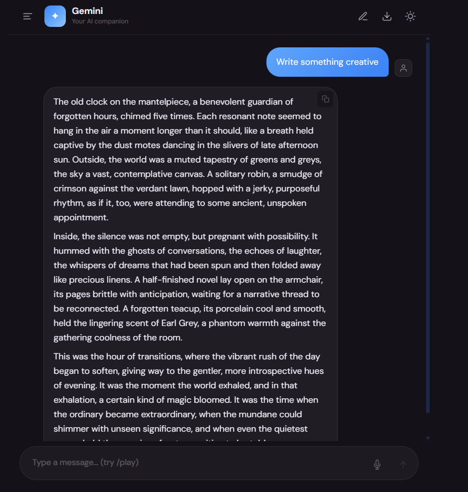
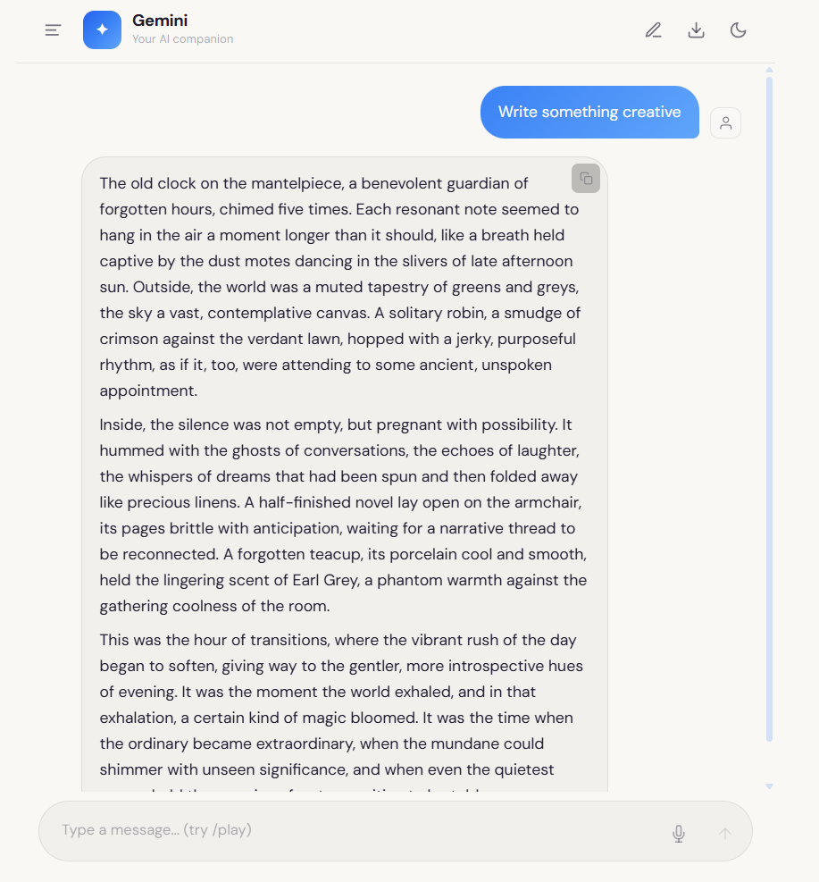
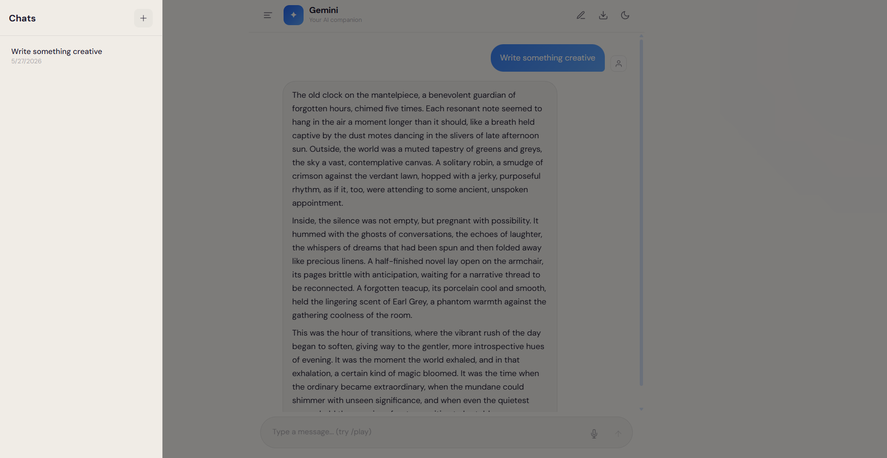

<div align="center">


<p>A clean, feature-rich AI chatbot built with React and powered by Google Gemini. Supports rich markdown rendering, math expressions, code execution, chat history, dark/light mode, and a built-in music player.</p>

<a href="https://basic-chat-bot-nine.vercel.app">Live Demo</a>

</div>

---

## Screenshots

| Home — Welcome Screen | Chat View — Dark Mode | Chat View — Light Mode | Sidebar — Chat History |
| :---: | :---: | :---: | :---: |
|  |  |  |  |
| *Time-aware greeting, quick-start prompt suggestions, and /play command hint.* | *AI response with full markdown rendering in dark mode.* | *Same conversation in light mode with copy button.* | *Persistent sidebar showing dated chat history.* |

---

## Features

### Chat Interface
- **Gemini AI Integration:** Powered by Google Gemini API for intelligent, context-aware responses
- **Quick-Start Prompts:** Pre-built suggestion cards on the home screen (Tell me something fun, Help me brainstorm, Write something creative, Explain something simply)
- **Time-Aware Greeting:** Dynamic welcome message based on the time of day (Good morning / afternoon / evening)
- **Markdown Rendering:** Full markdown support in AI responses via react-markdown — bold, italics, lists, headings, and more
- **Math Rendering:** LaTeX math expressions rendered beautifully using KaTeX
- **Copy Button:** One-click copy on any AI response message
- **Voice Input:** Microphone button in the input bar for voice-to-text messaging

### Sidebar & History
- **Chat History:** Persistent sidebar listing all past conversations with timestamps
- **New Chat:** Start a fresh conversation at any time via the `+` button
- **Collapsible Sidebar:** Toggle sidebar open/closed for a focused chat view

### Additional Features
- **Code Runner:** Dedicated `CodeRunner` component for syntax-highlighted code blocks in responses
- **Music Player:** Built-in `/play` command to trigger a lofi music player mid-conversation
- **Dark / Light Mode:** Theme toggle accessible from the header
- **Export Chat:** Download button to save conversation history
- **Responsive Layout:** Adapts cleanly across mobile, tablet, and desktop viewports

---

## Tech Stack

| Technology | Purpose |
| :--- | :--- |
| **React 19** | Core UI framework |
| **Vite** | Build tool and development server |
| **@google/generative-ai** | Google Gemini API client |
| **react-markdown** | Markdown rendering in chat responses |
| **KaTeX** | LaTeX math expression rendering |

---

## Getting Started

### Prerequisites

Ensure you have the following installed:
- Node.js (v18 or higher)
- npm or yarn
- A Google Gemini API key ([get one here](https://ai.google.dev))

### Installation & Setup

1. **Clone the repository**
```bash
git clone https://github.com/Asmit-64bit/Basic-ChatBot.git
cd Basic-ChatBot
```

2. **Install dependencies**
```bash
npm install
```

3. **Set up your API key**

Create a `.env` file in the root directory:
```env
VITE_GEMINI_API_KEY=your_gemini_api_key_here
```

4. **Start the development server**
```bash
npm run dev
```

Open [http://localhost:5173](http://localhost:5173) to view the application in your browser.

### Build for Production

```bash
npm run build
```

---

## Project Structure

```
Basic-ChatBot/
├── public/                        # Static assets served directly
├── src/
│   ├── assets/                    # Images and media files
│   │   ├── IMG-20251118-WA0030.jpg  # User avatar
│   │   ├── loading-spinner.gif    # Loading animation
│   │   ├── react.svg              # React logo
│   │   ├── robot.png              # Bot avatar
│   │   └── user.png               # User avatar fallback
│   ├── components/                # Reusable UI components
│   │   ├── ChatInput.jsx          # Message input bar with mic and send button
│   │   ├── ChatInput.css
│   │   ├── ChatMessage.jsx        # Single message bubble (user or bot)
│   │   ├── ChatMessage.css
│   │   ├── ChatMessages.jsx       # Scrollable list of all chat messages
│   │   ├── ChatMessages.css
│   │   ├── CodeRunner.jsx         # Syntax-highlighted code block renderer
│   │   ├── CodeRunner.css
│   │   ├── Header.jsx             # Top bar with title, theme toggle, export button
│   │   ├── Header.css
│   │   ├── MusicPlayer.jsx        # Lofi music player triggered by /play command
│   │   ├── MusicPlayer.css
│   │   ├── Sidebar.jsx            # Collapsible chat history sidebar
│   │   └── Sidebar.css
│   ├── services/                  # API and data services
│   │   ├── gemini.js              # Gemini API client and request handler
│   │   └── chatHistory.js         # Chat history persistence logic
│   ├── App.jsx                    # Root component — layout and state management
│   ├── App.css                    # Global app styles
│   ├── index.css                  # Base styles and CSS variables
│   └── main.jsx                   # React DOM entry point
├── index.html
├── vite.config.js
└── package.json
```

---

## API

This project uses the [Google Gemini API](https://ai.google.dev/). A free API key is available via Google AI Studio.

> **Note:** Keep your API key in `.env` and never commit it to version control. The `.gitignore` is already configured to exclude `.env`.

---

## License

This project is open source and available under the [MIT License](LICENSE).

---

<div align="center">
Built with ❤️ by <a href="https://github.com/Asmit-64bit">Asmit Samanta</a>
</div>